# SN
---
WRO documentation
<div align="center">

</div>


# Introduction
Team Flight is a group of high-school students from Ontario, Canada. This is our second year participating in WRO Future Engineers. We are passionate about robotics and is excited to compete in the open challenge and obstacle challenge for 2026. Our objective is to improve our score and documentation from last year and build a robot using hardware such as a LiDAR, Raspberry Pi 5, and new technology introduced to us like the Arduino Nano.

# Our coach
<table>
<tr>
  <td align="center" width="40%">
    <br>
  </td>

  <td valign="top" width="60%">
 - Head coach of Robotics Competitions, including FLL (First LEGO League),  WRO (World Robotics Olympiad) Robo Sports, Future Engineers, and Robo Mission. Led teams in winning multiple national, international robotics, and programming awards. <br>
  - MSc in Electrical & Computer Engineering from the University of Alberta. <br>
  - BSc in Mathematics from Peking University.<br>
  - Founder of Explorer Robotics, a local robotics club in Ajax and Whitby, teaching coding, AI, robotics, etc.
  </td>
</tr>
</table>

# Team Members
---
<table width="100%" style="border:2px solid #FFC107; border-radius:12px; margin:12px 0;">
  <tr>
    <td width="28%" align="center" style="padding:12px; border-right:6px solid #111;">
    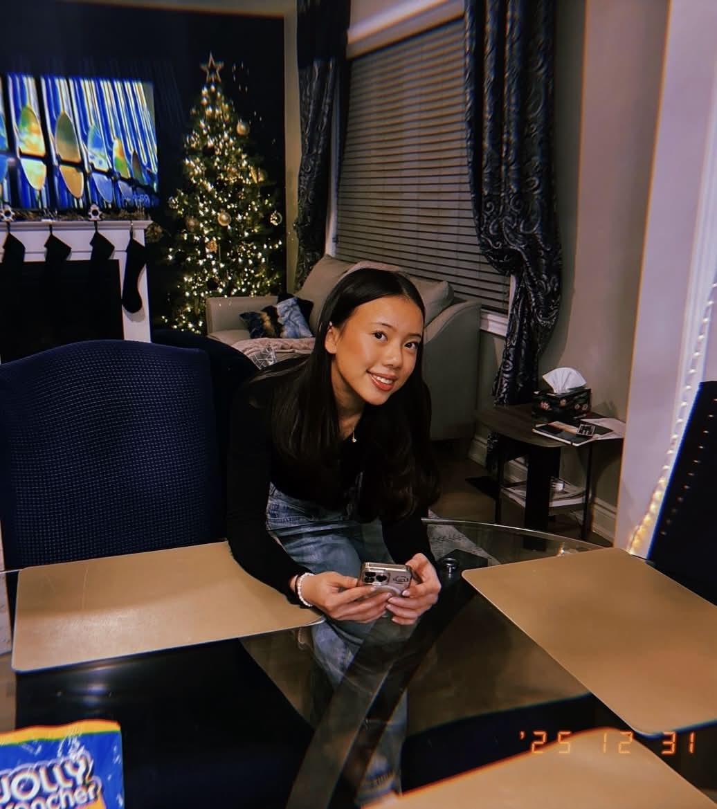
    </td>
    <td width="72%" style="padding:12px 16px;">
      <h3 style="margin:0 0 6px 0;">Nicole - nicolejin27@gmail.com</h3>
      <p style="margin-top:8px;">
        <b>About Me:</b> My Name is Nicole, I am 16 years old. I am a figure skater and I also do badminton and track and field for my school. I have been involved in coding and Explorer Robotics since I was 8 and did WRO Future Engineers last year as well.
      </p>
    </td>
  </tr>
</table>

<table width="100%" style="border:2px solid #FFC107; border-radius:12px; margin:12px 0;">
  <tr>
    <td width="28%" align="center" style="padding:12px; border-right:6px solid #111;">
    
    </td>
    <td width="72%" style="padding:12px 16px;">
      <h3 style="margin:0 0 6px 0;">Summer - summerlyu@gmail.com</h3>
      <p style="margin-top:8px;">
        <b>About Me:</b> My name is Summer, I am 17 years old. I love figure skating and drawing. I also do badminton, alpine skiing, and track and field for school. I starting coding when I was twelve years old and this is my second year doing WRO Future Engineers. 
      </p>
    </td>
  </tr>
</table>

# Team Photo

<table width="100%" style="border:2px solid #FFC107; border-radius:12px; margin:8px 0;">
  <tr>
    <td align="center" style="padding:14px;">
      <div style="border:2px dashed #FFC107; border-radius:10px; padding:24px; height:320px; display:flex; align-items:center; justify-content:center;">
        <b>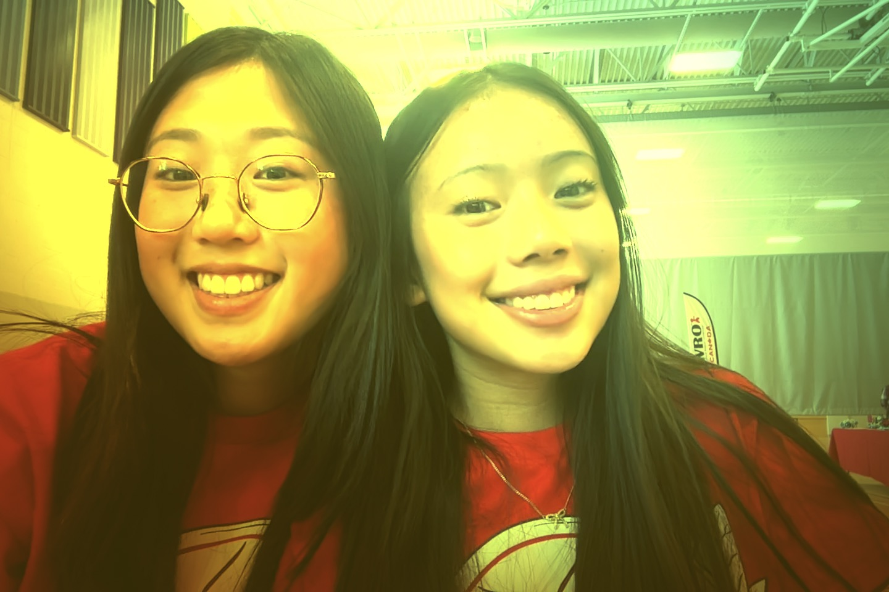</b>
      </div>
      <div style="margin-top:8px; color:#444;"><em>Team Flight</em></div>
    </td>
  </tr>
</table>

</div>

</br>
More team photos are provided in the "t-photos" folder. 

---


</br>

# Complete construction manual
The WRO Future Engineers is a competition for self-driven vehicles. Students need to design a model of a car, equip it with electromechanical components, and program it so that it can drive autonomously on the track, avoiding obstacles.
More details about the competition can be found on [the official site of WRO Association](https://wro-association.org/competition/2025-season/#rules).

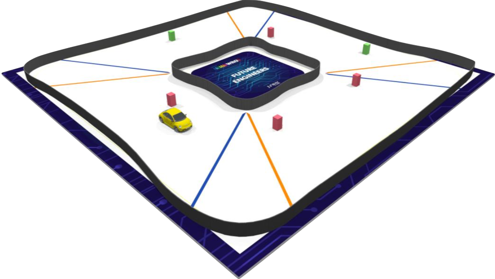
The materials are intended to be built with the [Mkdocs](https://www.mkdocs.org/) site generator.

The example of the site is accessible [here](https://world-robot-olympiad-association.github.io/future-engineers-gs/)


# Hardware
---
| Name | Product | Price (CAD)|
| ----------- | ----------- | ----------- |
| RC Car Battery | [`Gens Ace 1300mAh Battery`](https://genstattu.com/gens-ace-1300mah-2s-7-4v-45c-g-tech-lipo-battery-pack-with-deans-plug/?srsltid=AfmBOoo-qPXzcxuH2dIqTfVYg5ghG9WdKi2b53X-R9M8j3XF_JQlLKJL) | $20.60 | 
| Drive Motor | [`Furitek Micro Komodo 1212 3450KV Brushless Motor`](https://furitek.com/products/furitek-micro-komodo-1212-3456kv-brushless-motor-with-15t-steel-pinion-for-fury-wagon-fx118) | $35.00 |
| Servo Motor | [`HS-5055MG 11.9g Metal Gear Digital Micro Servo`](https://hitecrcd.com/hs-5055mg-economy-metal-gear-feather-servo/?srsltid=AfmBOooq_9U4Nehv90Y-tGWqZeo6_1c0_7imuMD9W_dBJmYS1m0sd2Y_) | $25.00 |
| ESC | [`Furitek Lizard Pro 30A/50A ESC`](https://furitek.com/products/combo-of-furitek-lizard-pro-30a-50a-brushed-brushless-esc-for-axial-scx24-with-bluetooth) | $80.00 |
| Camera | [`5MP 1080P HD Camera with OV5647 Sensor`](https://www.amazon.ca/dp/B0D324RKRZ?ref=ppx_yo2ov_dt_b_fed_asin_title) | $35.00 |
| Raspberry Pi 5 8GB | [`Raspberry Pi 5`](https://www.amazon.ca/RasTech-Raspberry-Pi-refroidisseur-inclus/dp/B0DQX6JPVM/ref=sr_1_1_sspa?dib=eyJ2IjoiMSJ9.hjnwoY6Di307ZP-ZXjYU_AmgdoLMC7RS47PGeKtJmhqRtp_k-4b8vYkHuUVwKECxKvsLZj0iaGIogN3I9EAYbOkkLP1mmeFujPf3GbJ2CMFnLyrk19mzn-ImTWQS0CIHPOqaTKx-Ctd1F3jpptYNuSYsMmNl7eHo3YlLS2jAkPG1yBTzWywAtMLtqPDw7h7ECNBYaTd1mWMee3tTjRJN-xMqYHvdCTQPK7nYLTwDF-fwzPk8SNqpdFTZ5PaxoJsqiCrI71GJKbHEhh34FjN7lpqwol6Q_mREib5Uh598Ms4.l7oHUekQqBFhZC9q36eu2RnnsxuvyE01mn0uqJH1tZQ&dib_tag=se&gad_source=1&hvadid=668188233052&hvdev=c&hvexpln=0&hvlocphy=9000756&hvnetw=g&hvocijid=14781734050545810589--&hvqmt=e&hvrand=14781734050545810589&hvtargid=kwd-916491466264&hydadcr=24946_13702398&keywords=raspberry+pi+5+8gb&mcid=370191aac5dd30dfa56c4c13736323b1&qid=1757276490&sr=8-1-spons&sp_csd=d2lkZ2V0TmFtZT1zcF9hdGY&psc=1) | $170.00 |
| Arduino | [`Arduino Nano 33 BLE Rev2`](https://www.digikey.ca/en/products/detail/arduino/ABX00071/22478340) | $33.41 |
| Chassis | [`Gyro Version Drift car 1:24 scale`](https://www.aliexpress.com/item/1005010792530908.html?spm=a2g0o.productlist.main.5.463crzyUrzyUt5&algo_pvid=6c0e6086-1ca4-4045-a5bf-e94f1b148090&algo_exp_id=6c0e6086-1ca4-4045-a5bf-e94f1b148090-6&pdp_ext_f=%7B%22order%22%3A%2218%22%2C%22eval%22%3A%221%22%2C%22fromPage%22%3A%22search%22%7D&pdp_npi=6%40dis%21CAD%21160.71%2173.43%21%21%21806.80%21368.66%21%402103129f17699789369692968ee635%2112000053523542620%21sea%21CA%210%21ABX%211%210%21n_tag%3A-29910%3Bd%3A7a4ca4d%3Bm03_new_user%3A-29895%3BpisId%3A5000000197831940&curPageLogUid=QLqgTPOX4VtS&utparam-url=scene%3Asearch%7Cquery_from%3A%7Cx_object_id%3A1005010792530908%7C_p_origin_prod%3A) | $163.05 | 
| LiDAR | [`LDROBOT D500 LiDAR Kit`](https://ca.robotshop.com/products/hiwonder-ld19-d500-lidar-developer-kit-360-dtof-laser-scanner-supports-ros1-2-raspberry-pi-jetson-nano?gad_source=1&gad_campaignid=20151193383&gbraid=0AAAAAD_f_xz33tsuMhLsCb4CO_w6kKcep&gclid=EAIaIQobChMI6sqDkubKkgMV1sKfCR2WSxPKEAAYASAAEgIzUfD_BwE) | $149.99 |
| Button | [`2 Pin Panel Push Button`](https://www.amazon.ca/dp/B01J9KO7DC?ref=ppx_yo2ov_dt_b_fed_asin_title&th=1) | $12.99 |
| Switch | [`DC AC rocker switch`](https://www.amazon.ca/Suitable-125V-250V-Motorcycle-Disconnect-Dispenser/dp/B087PYW9BS) | $5.99 |
| Power regulator | [`Power supply expansion board for raspberry pi 5`](https://ca.robotshop.com/products/yahboom-power-supply-expansion-board-raspberry-pi-5) | $17.54 |

**Total:** 748.57
**With Tax:** 845.88


## Mobility


- [ESC](#ESC)
- [Servo motor](#Servo-motor)
- [Drive motor](#Drive-motor)
- [Power regulator](#Power-regulator)
- [Chassis](#Chassis)
- [Steering and Drive system](#Steering-and-drive-system)

## Power
- [RC car battery](#RC-car-battery)
- [Ratings and Wiring](#Ratings-and-wiring)

## Sensors and Perception
- [Camera](#Camera)
- [Raspberry pi 5](#Raspberrypi-5)
- [Arduino](#Arduino)
- [LiDAR](#LiDAR)


## Extra
- [Switch](#Switch)
- [Button](#Button)

## Code
- [Open Challenge](#Open-Challenge)
- [Obstacle Challenge](#Obstacle-Challenge)


# Mobility 

## ESC
<table>
<tr>
  <td valign="top" width="35%">

    
 ### Physical Qualities
  | Field          | Value                              |
  |----------------|------------------------------------|
  | **Product Title** | Furitek Lizard Pro 30A/50A ESC   |
  | **Size**          | 28 × 15.5 mm                     |
  | **Weight**        | 3.7 g                            |
 

  </td>


  <td width="65%" align="center">
    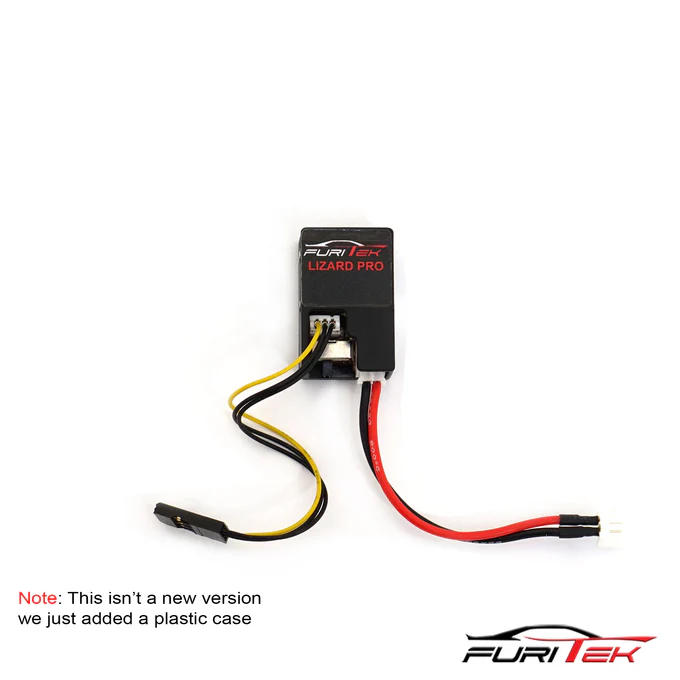<br>
    <em>Furitek Lizard Pro 30A/50A ESC</em>
  </td>
</tr>
</table>

  
### Why we chose this product

We chose Furitek Lizard Pro ESC because it controls the motors speed and ensure that voltage and current is safely delierved to the motor. It's small and manages direction on the open challenge and obstacle challenge. This ESC has a lightweight design, a high capacity and a reliable built-in BEC.


---

### Addtional information
- BIG BEC: **5V or 5V 2.5A**  
- Constant current : **30A**  
- Burst current: **50A**

[click here to return to links](#mobility)

## Servo motor
<table>
<tr>
  <td valign="top" width="35%">

### Physical Qualities
  | Field          | Value                                             |
  |----------------|---------------------------------------------------|
  | **Product Title** | HS-5055MG 11.9g Metal Gear Digital Micro Servo |
  | **Size**          | 0.89 x 0.45 x 0.94 inches                      |
  | **Weight**        | 9.5 grams                                      |
  | **Motor Type**    | 3 Pole Metal Brush Ferrite                     | 
  

  </td>


  <td width="65%" align="center">
    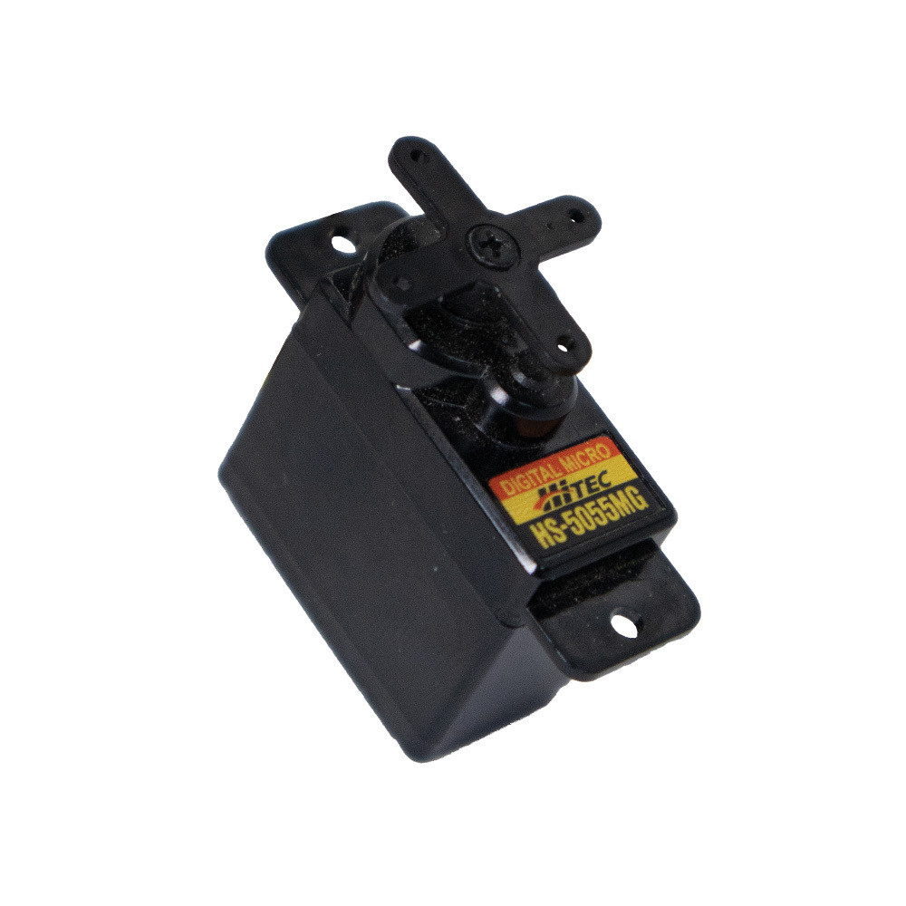<br>
    <em>HS-5055MG 11.9g Metal Gear Digital Micro Servo</em>
   </td>
</tr>
</table>

### Why we chose this motor 
We chose the Metal Gear digital Micro Servo because it has metal gears, which can withstand sustained high-speed voltage. It also has plastic casing around it which makes it light. Its compact and gives 1.3 ~ 1.6 kg./cm as maximum torque making it smooth and fast. 

### Additional information
- Operating Voltage Range: **4.8V ~ 6.0V**  
- Speed (Second @ 60°): **0.20 ~ 0.17**  
- Maximum Torque Range oz. / in.: **18 ~ 22**  
- No Load Operating Current draw: **120mA**    

</td>
</tr>
</table>

[click here to return to links](#mobility)


## Drive motor
<table>
<tr>
  <td valign="top" width="35%">

    
 ### Physical Qualities
  | Field          | Value                              |
  |----------------|------------------------------------|
  | **Product Title** | Furitek Micro Komodo 1212 3450KV |
  | **Size**          | 15.5 × 20.6 mm                   |
  | **Weight**        | 17.5 g                           |
  | **Physical State**| Brushless Outrunner (12-slot)    |

  </td>


  <td width="65%" align="center">
    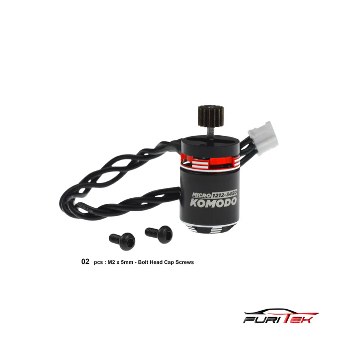<br>
    <em>Furitek Komodo 1212 motor</em>
  </td>
</tr>
</table>


  
### Why we chose this motor 

We chose Furitek Micro Komodo brushless motor because its very compact and light-weight making it easier for our car to manouver. It distrbutes torque smoother and more evenly which helps less cogging and better control. 

---

### Addtional information
- KV: **3450 rpm/V**  
- No-load @10V: **0.7 A**  
- Power: **120 W**  
- Battery: **2–3S LiPo**  
- Resistance: **0.16 Ω**  
- Max Current: **10 A**  
- Slot/Pole: **12**  
- Shaft: **1.5 × 6 mm**

[click here to return to links](#mobility)

## Power regulator
<table>
<tr>
  <td valign="top" width="35%">

    
 ### Physical Qualities
  | Field          | Value                              |
  |----------------|------------------------------------|
  | **Product Title** |  Power supply Expansion board for Raspberry Pi 5  |
  | **Weight**        |      32g                           |
  | **Size**          |      65 by 56mm                 |


  </td>


  <td width="65%" align="center">
    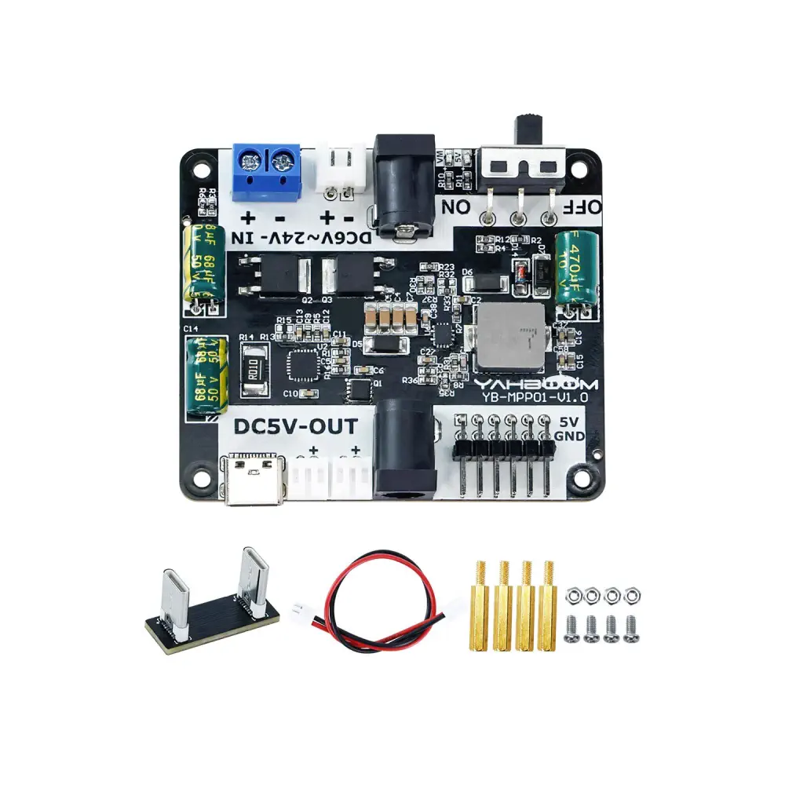<br>
    <em>Power regulator</em>
  </td>
</tr>
</table>

  
### Why we chose this product
We chose this power supply expansion board because it was tailor made for raspberry-pi. It has many input and output ports and it has efficient voltage stabilization technology, ensuring that the input power supply is stably adjusted for the 5V/5A output, which meets the power needs for the raspberry pi perfectly. Using this power regulator prevents potential low-voltage operation risks and USB interface current limitation. It can also stack directly onto the raspberry pi with screw copper posts, which makes our car more compacts and easier to turn. 
 

---

### Addtional information
- Voltage input: **6~24V**
- Voltage output: **5V/3A (6V Input), 5V/5A (7~24V input)**
-  Output interference: **Type-C, PH2.0-2pin*2, DC5.5*2.1, 2*6pim Bent pin header**
-  Through hole diameter: **M2.5mm**

[click here to return to links](#mobility)

## Chassis
<table>
<tr>
  <td valign="top" width="35%">

    
 ### Physical Qualities
  | Field          | Value                              |
  |----------------|------------------------------------|
  | **Product Title** |    RC Drift Car 1:24 Scale |
  | **Weight**        |      110g                           |
  | **Size**          |       21 x 9.5 x 6 cm               |
 

  </td>


  <td width="65%" align="center">
    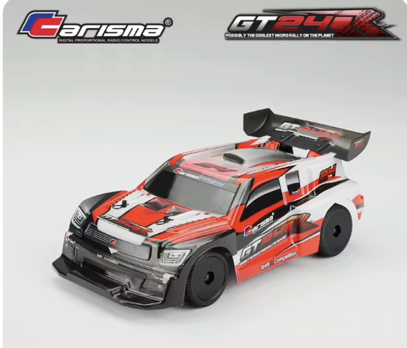<br>
    <em>  RC Drift Car 1:24 Scale</em>
  </td>
</tr>
</table>

  
### Why we chose this product
We chose this chassis because it was easy to take apart and use as a sturdy base for our robot. It was lightweight and many parts could easily be taken apart to make space for the motors and battery to fit inside. Its dimensions are long enough to include every component, but doesn't hinder the functionality of the robot. The wheels are made of grippy materials, making the robot be able to turn easily and with accuracy. The base if flat, making it easy to mount our 3D printed pieces that hold up our camera and raspberry Pi. 

### Placement choice for components
- The camera is placed at a level where it's able to see incoming walls, pillars, and obstacles at a reasonable distance without being to high causing an imbalance. It's placed at an angle where it includes the space in front of the robot, but not what on the robot.
- The LiDAR is placed at the front of the robot to ensure it is detected well in advance so our robot is prepare to avoid the oncoming obstacle from all directions. By placing it in the front, it doesn't need to calculate the difference between the obstacle and the bumper. Placing the LiDAR at a low point prevents anything from blocking the sensors. 
- By putting the motors, esc, and battery close together under the raspberry Pi, it reduces the amount of wires around the robot, making it more organized and clean. We can also place the wires underneath, saving space and preventing it from getting in the way or getting loose.

---

### Addtional information
- Ranging Distance: **0.03-12m**

[click here to return to links](#mobility)

## Steering and drive system
### Steering
Our chassis didn't have a large enough steering angle, but with many adjustments, we hollowed a larger compartment and cut limitations so our chassis can turn sharper around pillars and corners. In the hollowed compartment, we put both our motors, keeping it compact and saving space. 

- Both left and right wheels turn at the same angle, reducing imbalance and oversteering.
- By keeping it compact more of the weight is focused lower, making uncontrolled movement minimized and more predictable steering.
- Larger steering angle makes last minute navigation easier around pillars and walls. 

### How the car moves 

When the battery provides power, the ESC manages the electricity sent to the motor. The motor turns this controlled flow of electricity into rotational motion, which makes the car's wheels spin. By changing the voltage and current through the ESC, we can control the car's speed and direction, enabling it to move forward, backward, accelerate, slow down, or reverse.

At the same time, the servo motor handles steering. It changes the angle of the front wheels through the steering system, allowing the car to turn left or right accurately.

### Drive system 
Our car uses a real whieel drive (RWD), meaning that the motor's power is transmitted to the back wheels rather than the front. This configuration provides many benefits to the car:
- Better weight distribution. The front wheels handle all the steering, and the rear wheels help with propulsion, whith helps the car remain more balanced when accelerating and turning. 
- Provides a stronger grip on surfaces such as the map. Since the rear of the robot has more weight, the back wheels get pressed down into the ground more, providing more traction and grip. 
- The front wheels are used only for steering, this is so the car can turn more precisely aince theres no interference from the motor. 


[click here to return to links](#mobility)
# Power


## RC car battery
<table>
<tr>
  <td valign="top" width="35%">

  ### Physical Qualities
  | Field | Value |
  |--------|--------|
  | Product Title | Gens Ace 1300mAh 2S 7.4V 25C LiPo |
  | Size | 70.9 × 35.2 × 14.5 mm |
  | Weight | 90 g |
 
  
  </td>

  <td align="center" width="65%">
    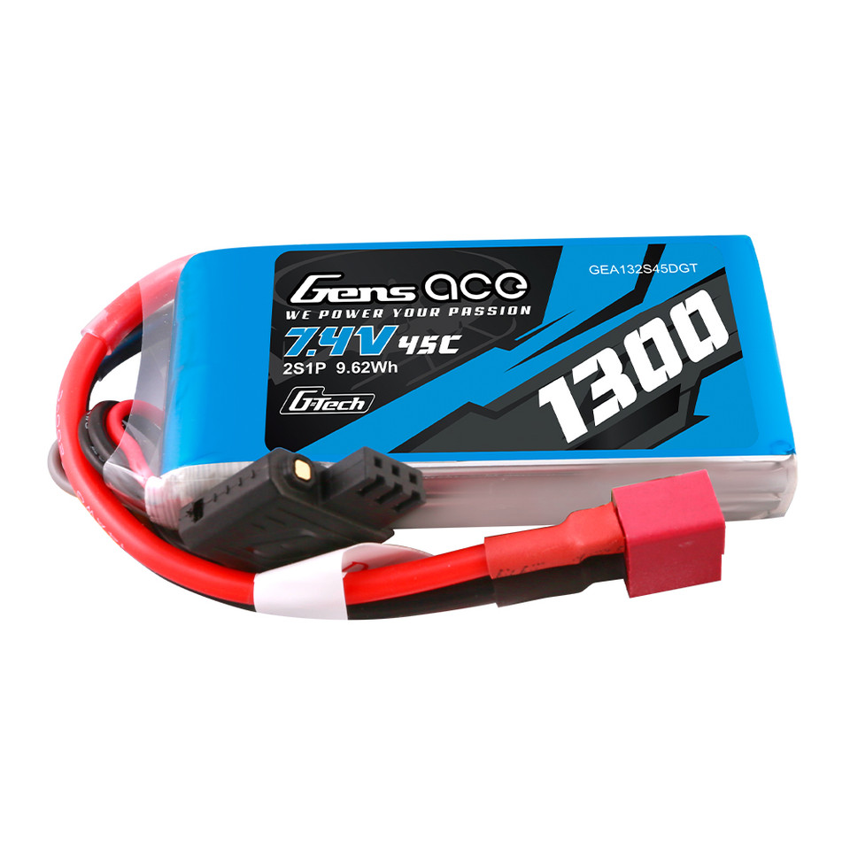<br>
    <em>Gens Ace 1300mAh 2S LiPo Battery</em>
  </td>
</tr>
</table>

### Why we chose this battery
We chose the Gens Ace Battery because its lightweight and provides a long run time between charges. 
It allows us to keep the self-driving car well balanced which is optimal for the obstacle challenge and open challenge. 
The 7.4V gives good acceleration without noticeable voltage drop and offers stable power delivery without extra wear. 

---


### Additional information
- Voltage: **7.4V**  
- Capacity: **1300mAh**  
- Discharge Rate: **45C Continuous / 90C Peak**  
- Charge Rate: **5C (6.5A Max)**
- Cell Configuration: **2S1P**  
- Watt Hours: **9.62Wh**  

The battery is secured to our robot by tape on the bottom. <br>
[click here to return to links](#mobility)

---

##  Ratings and wiring

### Power ratings table

| Component | Voltage | Normal Current Draw | Max Current Draw | Normal Power | Max Power |
|-|-|-|-|-|-|
| Camera         | 5 V     | 0.16 A   | 0.20 A | 0.80 W  | 1.00 W  |
| Furitek Lizard Pro ESC      | 7.4 V   | 0.007 A  | 0.10 A | 0.05 W  | 0.74 W  |
| Furitek Micro Komodo Motor  | 7.4 V   | 0.95 A   | 10.0 A | 7.00 W  | 74.0 W  |
|  Servo Motor       | 5 V     | 0.10 A   | 0.70 A | 0.50 W  | 3.50 W  |
| MicroSD, LEDs,     | 5 V     | 0.12 A   | 0.30 A | 0.60 W  | 1.50 W  |
| Raspberry Pi 5              | 5 V     | 0.55 A   | 2.00 A | 2.75 W  | 10.0 W  |
| Expansion Board             | 5 V     | 0.12 A   | 0.50 A | 0.60 W  | 2.50 W  |

<br>

Our Gens Ace 1300 mAh 7.4V  Lipo Battery provides plenty of power to our car as shown in the power ratings table above/ 
This will ensure that all our properties will run smoothly and provide stable voltage for the Raspberry Pi, controller, sensors, and periherals. <br>
**Estimated runtime (Active driving run):** 20-28 minutes <br>
**Estimated runtime (Idle/bench testing):** 45-60 minutes <br> <br>
### Electrical wiring
<div algn="center">
<table>
  <tr>
    <td style="border: 200px solid black; padding: 5px;">
      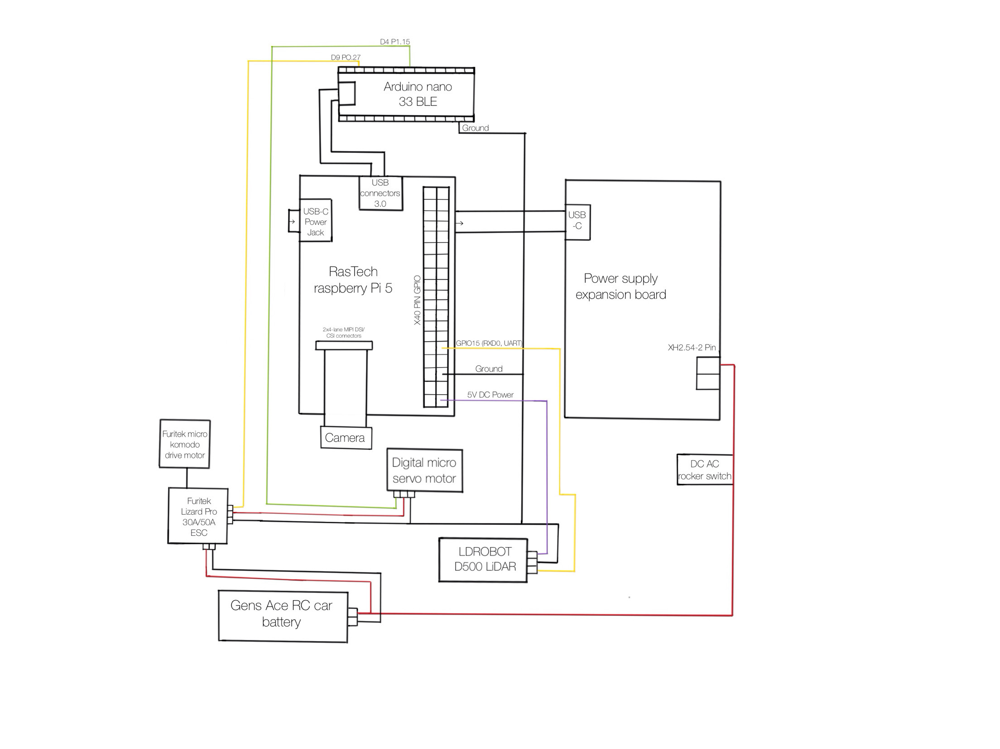
    </td>
  </tr>
</table>

</div>

### Components

- Raspberry Pi 5
- Expansion Board
- Camera
- Servo Motor
- ESC (Electronic Speed Controller)
- Motor
- Battery
- Switch


[click here to return to links](#mobility)

# Sensors and Perception

## Camera
<table>
<tr>
  <td valign="top" width="35%">

    
 ### Physical Qualities
  | Field          | Value                              |
  |----------------|------------------------------------|
  | **Product Title** | 5/Zero Camera Module (OV5647 Sensor)   |
  | **Cable**         | 15 cm Ribbon Cable                     |
  | **Weight**        | 20 g                                   |
  | **Size**          | 11.6 x 6.6 x 3.7 cm                    |

  </td>


  <td width="65%" align="center">
    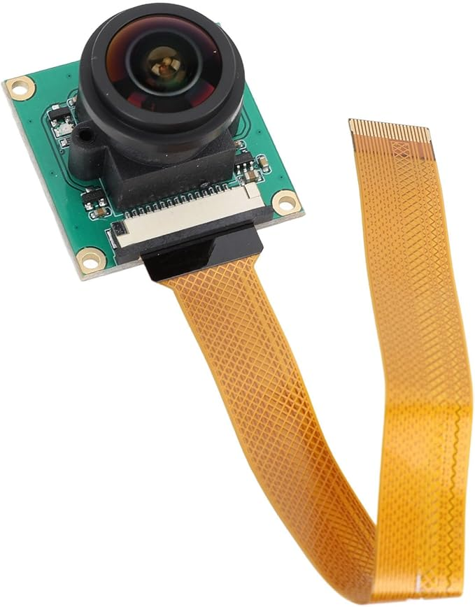<br>
    <em>5/Zero Camera Module (OV5647 Sensor)</em>
  </td>
</tr>
</table>

  
### Why we chose this product

We chose the 5/Zero Camera Module because we can use the wide angle camera lens to track the regions of interest and limit the amount of blind spots during the open challenge. It's 175° lens is good for wall detection and true to life colors with automatic light adjustment. It's very compatible with the raspberry pi and easy to install. It can withstand heat up to 70° celcius, making it suitable when we need to use it for longer periods of time. 

---

### Addtional information
- Material: **ABS+ Optimal glass**  
- Lens Pixel : **5MP**  
- Focal Length: **3.6mm**
- Lens Angle: **175°**
- CMOS Size: **1/2.5inch**
- Resolution: **2592x1944**

[click here to return to links](#mobility)
  
  
## Raspberrypi 5
<table>
<tr>
  <td valign="top" width="35%">

    
 ### Physical Qualities
  | Field          | Value                              |
  |----------------|------------------------------------|
  | **Product Title** | RasTech Raspberry Pi 5 Kit (8GB RAM)   |
  | **Weight**        | 70 g                                  |
  | **Size**          | 15 x 9.9 x 3.9 cm                      |
  | **Comes with**    | Pi 5 Board, Case, Active Cooler, Screwdriver |


  </td>


  <td width="65%" align="center">
    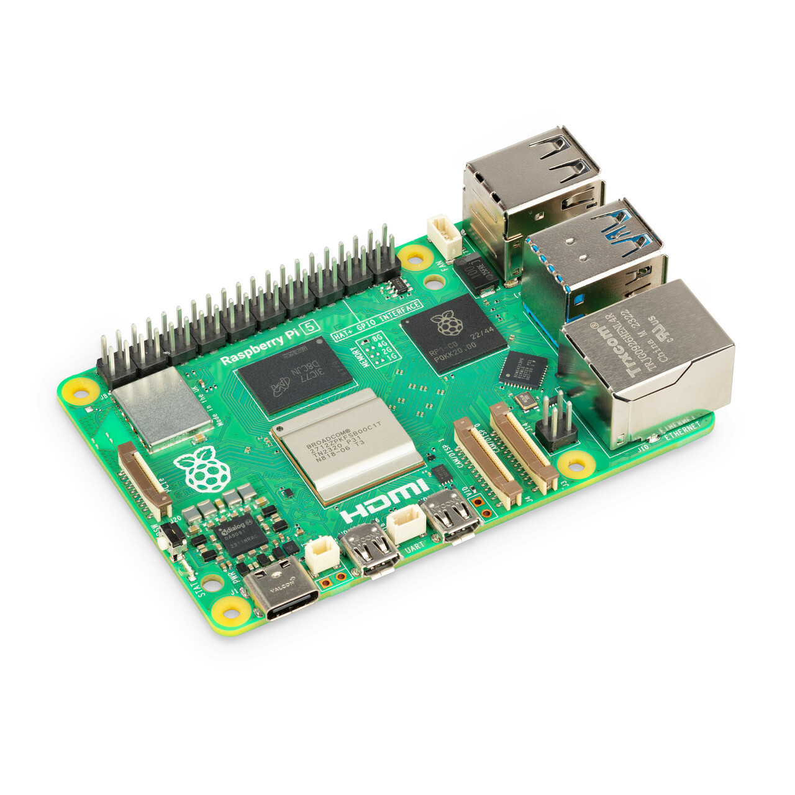<br>
    <em>RasTech Raspberry Pi 5 Kit (8GB RAM)</em>
  </td>
</tr>
</table>

  
### Why we chose this product

The main part of our robot is the Raspberry Pi 5 and it controls the computer vision and LiDAR data interpretation. It is perfect for energy comsumption and processing power, making it suitable for running our Python codes for the open challenge and obstacle challenge. 

### Parking
We have planned on using the LiDAR for the parallel park section at the beginning and end of the obstacle challenge, but we haven't had the change to progress that far this year. We have the placement and layout for the use of the LiDAR and we will continue to work on its use and progression in the future. So, we are not going to be using the LiDAr for the obstacle challenge this year. 

---

### Addtional information
- Manufacturer: **Vemico**  
- Wireless : **802.11ac Wi-Fi, Bluetooth**  
- Processor: **Broadcome BCM2712, Quad-Core Cortex-A76 @ 2.4 GHz**
- RAM: **8 GB LPDDR4X-4266**
- GPU: **VideoCore VII (Integrated)**
- Storage: **microSD**
- Ports: **2x USB 3.0, 2x USB 2.0, 2x micro HDMI, Ethernet, GPIO**
- OS: **Raspberry Pi OS**

[click here to return to links](#mobility)
  
## Arduino
<table>
<tr>
  <td valign="top" width="35%">

    
 ### Physical Qualities
  | Field          | Value                              |
  |----------------|------------------------------------|
  | **Product Title** |   Arduino nano 33 BLE REV2 |
  | **Weight**        |  5g                                  |
  | **Size**          |   45mm x 18mm                 |
 

  </td>


  <td width="65%" align="center">
    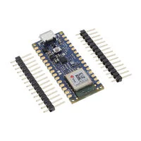<br>
    <em> Arduino nano 33 BLE REV2</em>
  </td>
</tr>
</table>

  
### Why we chose this product
The 4 PWM pins makes it versatile for various embedded applications/ It's super compatible with the arduino IDE, making the programming smooth and seamless. It weighs only 5 grams which minimizes load on the chassis, allowing for better acceleration and agility. 

### How the arduino and raspberry Pi communicate
The Raspberry Pi handles the LiDAR's mapping, vision processing, and path planning while offloading low-level GPIO operations (ESC PWM signaling, steering servo adjustments, wheel encoder interrupts) to the Nano. Connecting the Arduino Nano directly to the Pi 5's USB 3.0 port provides both power and a clean USB-Serial interface without needing external voltage level shifters. The Pi 5's GPIO pins strictly operate at 3.3V. Interfacing 5V sensors directly through the Nano's native 5V-tolerant analog/digital pins prevents accidental overvoltage damage to the Pi. 

---

### Addtional information
- Logic level voltage: **3.3V**
- Input voltage: **5V to 18V**
- Digital I/O Pins: **14**
- Clock speed: **64 MHz**
- Flash memory: **1MB**


After we soldered the arduino, it was secured tightly to our robot using double sided tape on the USB ports of the raspberry pi. <br>
[click here to return to links](#mobility)

## LiDAR
<table>
<tr>
  <td valign="top" width="35%">

    
 ### Physical Qualities
  | Field          | Value                              |
  |----------------|------------------------------------|
  | **Product Title** | LDROBOT D500 LiDAR   |
  | **Weight**        | 45 g                                  |
  | **Size**          | 54 × 46.3 × 35 mm                     |
 

  </td>


  <td width="65%" align="center">
    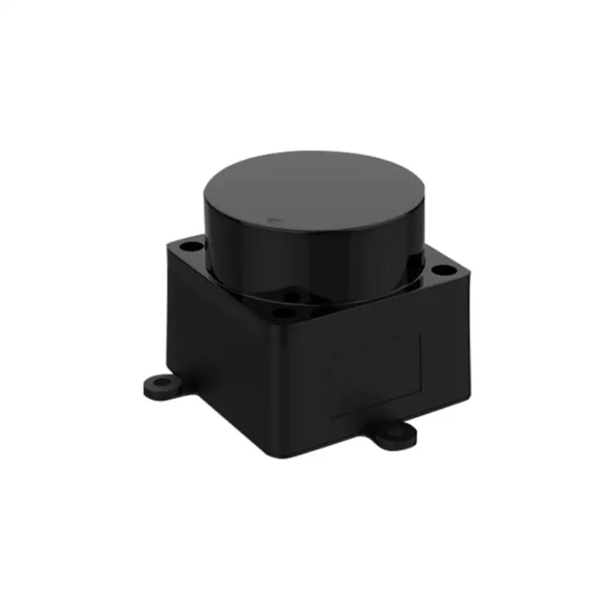<br>
    <em>LDROBOT D500 LiDAR </em>
  </td>
</tr>
</table>

  
### Why we chose this product

 We are going to use the LDROBOT D500 LiDAR for obstacle challenge because it provides accurate range data in every direction up to 12 meters. We are also switching to use the LiDAR instead of the camera because it doesn't depend of good lighting to function properly. With its long scanning range, it can detect obstacles further away and then turn accordingly. 

---

### Addtional information
- Ranging Distance: **0.03-12m**  
- Accuracy : **±10 mm (0.3–0.5 m), ±20 mm (0.5–2 m), ±30 mm (2–12 m)**  
- Scanning Angle: **360°**
- Scanning frequency: **6-13 Hz**
- Ranging frequency: **5000Hz**
- Wavelength: **895 – 915 nm (Typ. 905 nm)**
- Interface: **UART @ 230400 baud**
- Ambient Light Tolerance: **up to 60k Lux**
- Power Supply: **5V**
- Power Comsumption: **1.45W (290 mA)**
- Operating Temp: **-10° to 45° C**

[click here to return to links](#mobility)

# Extra
  
## Button
<table>
<tr>
  <td valign="top" width="35%">

 | Field          | Value                              |
  |----------------|------------------------------------|
  | **Product Title** |   2 Pin Panel Push Button |
  | **Weight**        |            22.68 g                |
  | **Size**          |     16.51 x 0.51 x 0.51 cm   |
  |**Brand**          |   MakerSpot  |
  | **Material**      |  tile |


  </td>


  <td width="65%" align="center">
    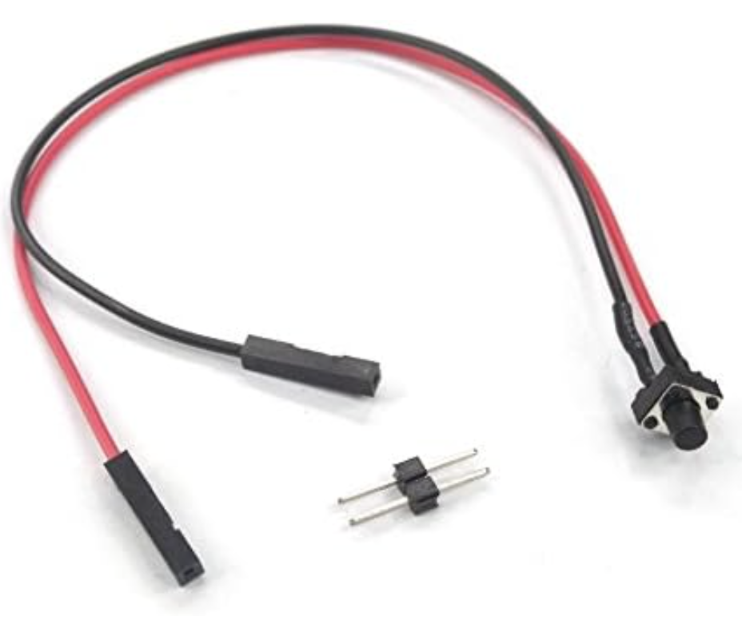<br>
    <em>2 pin push button</em>
  </td>
</tr>
</table>

  
### Why we chose this product
We chose this button for our raspberry Pi because it's very simple yet easy incorporate onto our robot. Since adding this button was a last minute detail, it's lightweight and small design allows an easy attachment without getting in the way of the other robot components. 
 

---

### Addtional information
- Current rating: **50 milliamps**
- Terminal: **solder**
- Contact material: **copper**
- Mounting type: **through hole mount**
- Operating mode: **manual**
  
[click here to return to links](#mobility)
## Switch
<table>
<tr>
  <td valign="top" width="35%">

 | Field          | Value                              |
  |----------------|------------------------------------|
  | **Product Title** |  DC AC rocker switch  |
  | **Weight**        |        4g                    |
  | **Size**          |    1.1cm by 2.1cm by 1.5cm      |
  |**Brand**          |  	EKYLIN   |
  |**Material**       | Metal, plastic  |


  </td>


  <td width="65%" align="center">
    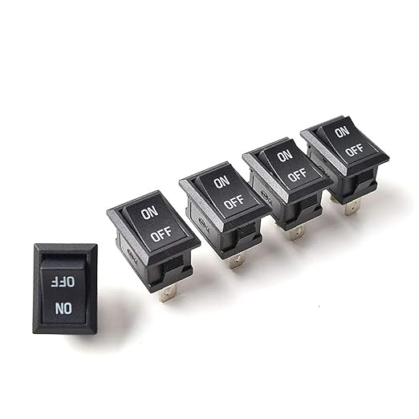<br>
    <em>DC AC rocker switch</em>
  </td>
</tr>
</table>

  
### Why we chose this product
We choose this switch because it was simple and easy to install. This switch is suitable for AC 125V 10A, AC 250V 6A, DC 12V 20A, DC 24V 10A, DC 36V 6.5A. It was made by an insulated plastic and copper pins, with a mechanical life of more than 8 thousand cycles and an electrical life of more than 10 thousand. The high operating temperature allows it to still work and function properly when it is used for an extended period of time. 
 

---

### Addtional information
- Current rating: **10 amps**
- Operating voltage:**125 Volts (AC)**
- Insulation resistance: **100MΩ min**
- Operating temperature: **-25°C~85°C**

[click here to return to links](#mobility)

  


# Tools and Equipment
| Name | Product | Price (CAD)|
| ----------- | ----------- | ----------- |
| 3D Printer | [`Bambu Lab X1 Carbon 3D Printer`](https://genstattu.com/gens-ace-1300mah-2s-7-4v-45c-g-tech-lipo-battery-pack-with-deans-plug/?srsltid=AfmBOoo-qPXzcxuH2dIqTfVYg5ghG9WdKi2b53X-R9M8j3XF_JQlLKJL) | $1289 | 
| Soldering Kit| [`TOAUTO DS90 Soldering Station`](https://www.amazon.ca/FASTTOBUY-Soldering-Station-194%C2%B0F-896%C2%B0F-Temperature/dp/B082HP4513?source=ps-sl-shoppingads-lpcontext&ref_=fplfs&smid=A1QHHBFTGR8LSC&th=1) | $90 |
| Screws, Screwdriver, Pliers, etc. | n/a | $~35 |  
| Fillament 1kg | [`EconoFil™ Standard PLA Filament`](https://www.inksmith.ca/collections/filament/products/econofil-standard-pla-filament-black-1-75mm-1-kg?variant=50056253276442) | $26 |  

**Total:** $~1440 *No Tax*

**With Tax:** $~1627.2

# 3D design and fabrication

| *Component that holds the raspberry pi, arduino and power regulator* | <br>
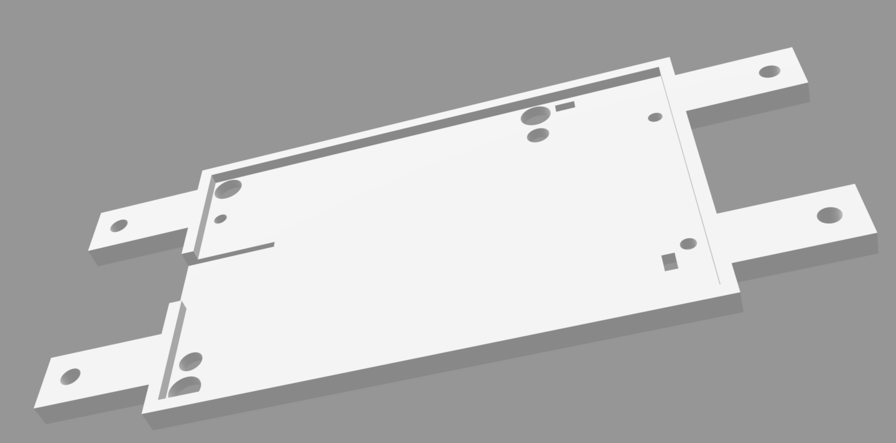 <br>
| *Component that holds the camera up*| <br>
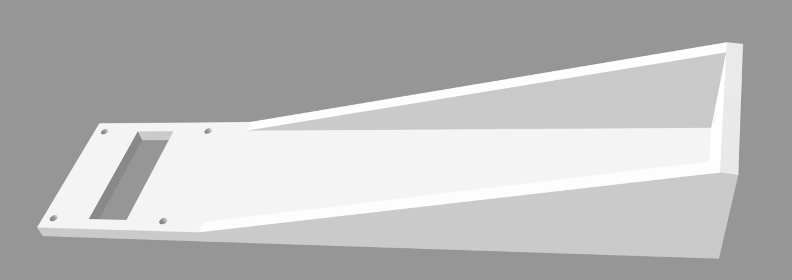  <br>

Full interactive models provided in the "models" folder. <br>

### Overview
- a main part of our project was the 3D print which allowed us to design and refine custom parts of our chassis for best results
- Our 3D print held major components to the function of our robot like the arduino, raspberry pi, power regulator, camera, and liDar.
- Fabrication in Onshape, printing using Prusa MK4 with PLA filament

### Printing information

| Setting | Value |
|----------|--------|
| Printer | [`Prusa MK4`](https://www.prusa3d.com/product/original-prusa-mk4s/?utm_source=google&utm_medium=cpc&utm_campaign=EN-CA_Search_Text_Brand&utm_id=804628075&gad_source=1&gad_campaignid=804628075&gbraid=0AAAAADkiZoOd65faDM0bHRhBQj7ky7NcF&gclid=CjwKCAjwhe3OBhABEiwA6392zNFtJI5Mq8r8JDHuuQUJW8VSS6PgJko4EIIhgfwNkfE0DJi9G7rwxBoCjJwQAvD_BwE) |
| Material | PLA |
| Nozzle Temperature | 230 °C |
| Bed Temperature | 65 °C (Textured PEI Plate) |
| Filament Diameter | 1.75 mm |
| Flow Ratio | 0.96 |
| Max Volumetric Speed | 12 mm³/s |
| Layer Height | 0.2 mm |
| Nozzle Diameter | 0.4 mm |
| Infill Density | 15 % |

We chose PLA because of it's easy accessibility and affordable cost, allowing quick iteration without sacrificing accuracy. It's proformance is reliable, and it is easy to print again if there was a mistake. 

### Photo gallery 
<table>
  <tr>
    <td align="center" style="border:1px solid #ddd; padding:15px;">
    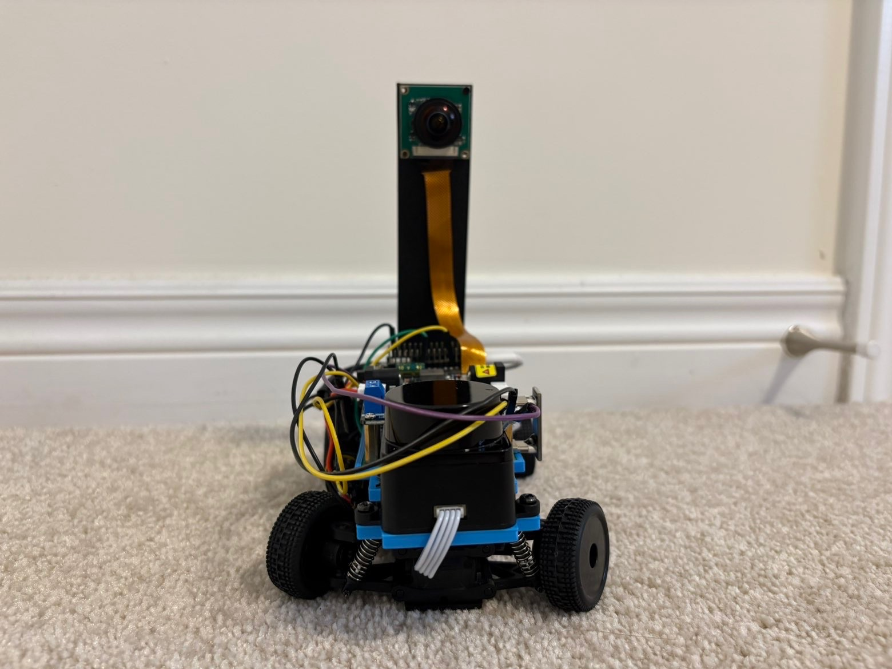<br/>
      <em><strong>Front View </strong></em>
    </td>
    <td align="center" style="border:1px solid #ddd; padding:15px;">
      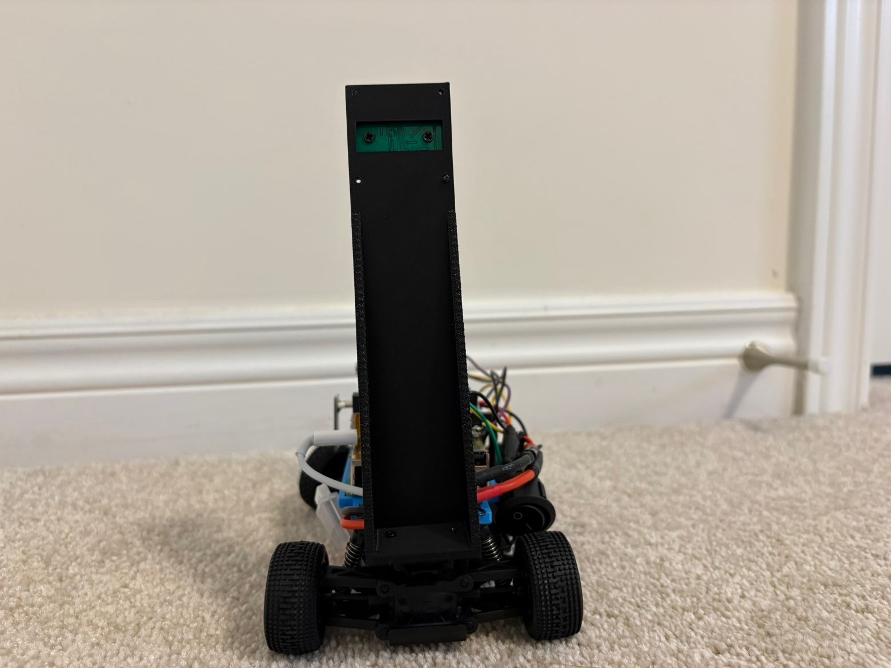<br/>
      <em><strong>Back view</strong></em>
    </td>
    <td align="center" style="border:1px solid #ddd; padding:15px;">
     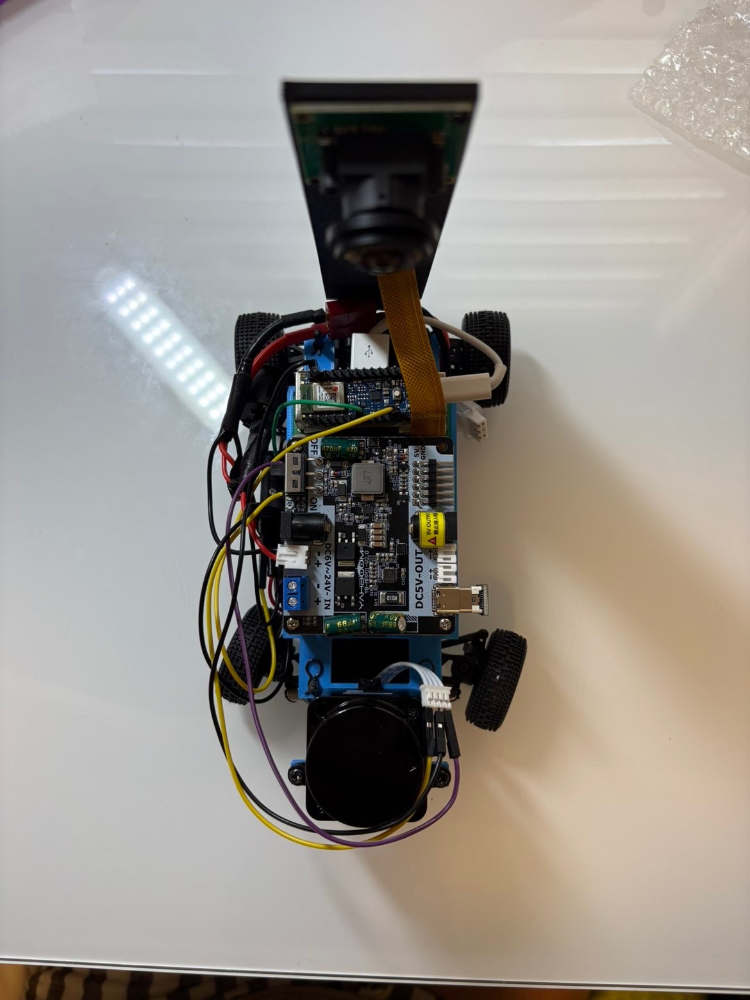<br/>
      <em><strong>Top View</strong></em>
    </td>
  </tr>
  <tr>
    <td align="center" style="border:1px solid #ddd; padding:15px;">
     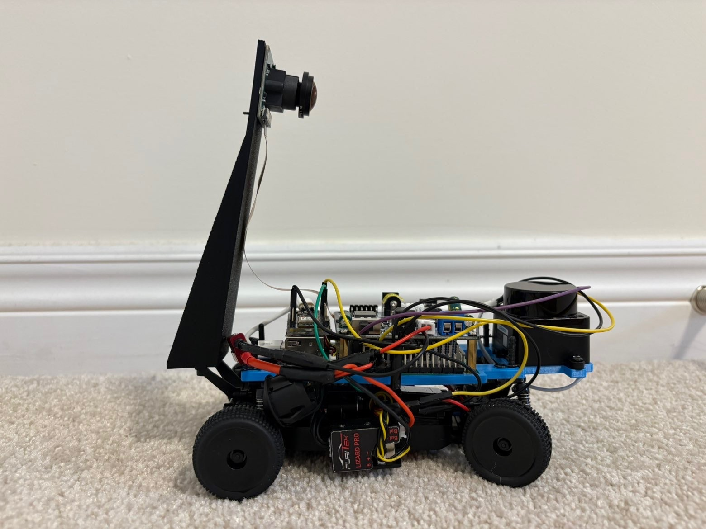<br/>
      <em><strong>Left Side View</strong></em>
    </td>
    <td align="center" style="border:1px solid #ddd; padding:15px;">
      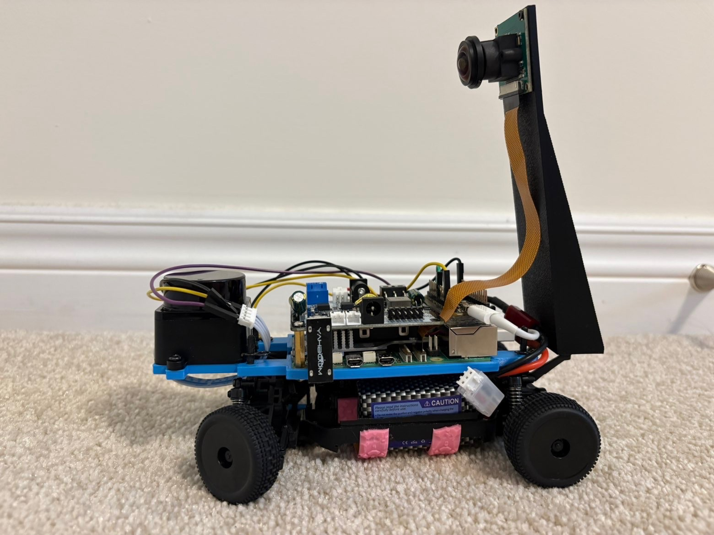<br/>
      <em><strong>Right Side View</strong></em>
    </td>
    <td align="center" style="border:1px solid #ddd; padding:15px;">
      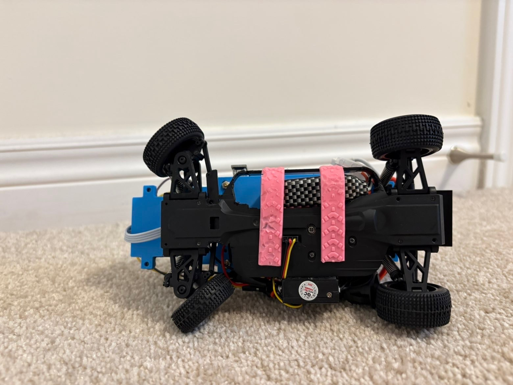<br/>
      <em><strong>Bottom View</strong></em>
    </td>
  </tr>
</table>
<br>
---

# Open Challenge
## Overview
The Open Challenge is designed to test a robot’s ability to autonomously navigate a closed-loop course using only the black walls as guidance. The robot must detect walls, align itself, make smooth turns at corners, and complete 3 laps without manual intervention in under 3 minutes. The main focus is on path-following and code accuracy. Visit the Youtube video linked below for more in-depth information. <br>

Youtube Link: <br>
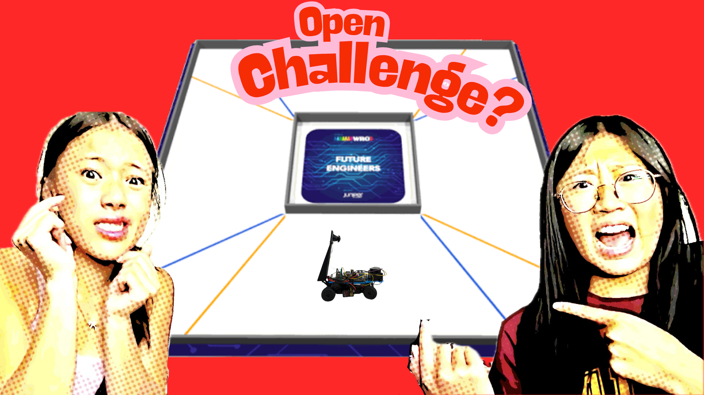 <br>
<a href="https://youtu.be/M6A6o3CX_g0">Team Flight Open Challenge 2026 </a> 

---

### Game Map

<table>
  <tr>
    <td style="border: 200px solid black; padding: 5px;">
      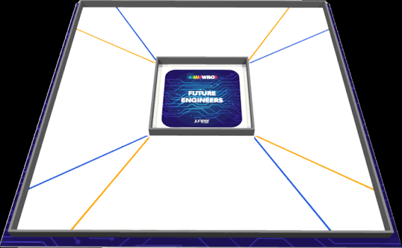
    </td>
  </tr>
</table>


## Code
```
import sys
import time
import threading
import subprocess
import cv2
import numpy as np
from picamera2 import Picamera2
import os
import signal
import serial
from enum import Enum

def send(cmd):
    try:
        arduino.write(cmd)
        #print(cmd)
    except serial.SerialTimeoutException:
        arduino.reset_output_buffer()
        try:
            arduino.write(cmd)
        except serial.SerialTimeoutException:
            print("not working")
            
        

class State(Enum):
    WALL_FOLLOW = 1
    CORNER_TURN = 2

state = State.WALL_FOLLOW

prev_error = 0

# Debounce
trigger_count_left = 0
trigger_count_right = 0
TRIGGER_FRAMES = 5

# Trigger memory
#trigger_side = None  # "left", "right"

# Timing

corner_start_time = 0
MIN_CORNER_TIME = 2

# IMU heading tracking
last_heading_time = time.time()
HEADING_INTERVAL = 1.0 # request heading from Arduino every 1 second
imu_heading = 0.0

# Handle debug mode
n = len(sys.argv)
debugMode = 1
if n > 1 and sys.argv[1] == "Debug":
    debugMode = 1

arduino = serial.Serial('/dev/ttyACM0', 115200, timeout=1, write_timeout = 0.05)
time.sleep(2)


# Initialize the camera
picam2 = Picamera2()
picam2.preview_configuration.main.size = (700, 480)
picam2.preview_configuration.main.format = "RGB888"
picam2.preview_configuration.controls.FrameRate = 30
picam2.configure("preview")
picam2.start()
#time.sleep(1)

center_servo = 90
min_servo = 60
max_servo = 120

# Proportional gain constant 
Kp = 0.009
Kd = 0

counter = 0

lower_black = np.array([0, 0, 0])
upper_black = np.array([180, 255, 100])

lower_orange = np.array([88, 56, 107])
upper_orange = np.array([116, 224, 255])

lower_blue = np.array([0, 97, 88])
upper_blue = np.array([19, 255, 255])
# Regions of interest
roiLeft = (20, 220, 200, 80)
roiRight = (500, 220, 200, 80)
roiOrange = (220, 300, 240, 50)
roiBlue = (220, 300, 240, 50)
# Start motor
send(b'@M1630\n')
send(b'@S90\n')

orange = 0
orange_line_detected = False
last_orange_time = time.time()
blue = 0
blue_line_detected = False
last_blue_time = time.time()

turning_angle = 0

cooldown_seconds = 3

while True:
    now = time.monotonic()
    
    frame = picam2.capture_array()

        # Periodically request IMU heading from Arduino
    if time.time() - last_heading_time >= HEADING_INTERVAL:
        send(b'@H\n')
        last_heading_time = time.time()
        time.sleep(0.02) # brief wait so response arrives before we read
    # Read and process all incoming serial data
    if arduino.in_waiting > 0:
        try:
            raw = arduino.read(arduino.in_waiting).decode('utf-8', errors='ignore')
            for line in raw.splitlines():
                line = line.strip()
                if not line:
                    continue
                try:
                    imu_heading = float(line)
                    #print(f'[IMU Heading] {imu_heading:.2f}°')
                except ValueError:
                    pass # ignore any non-numeric lines
        except Exception:
            pass # silently ignore malformed or partial data
    
    if arduino.in_waiting > 0:
        arduino.read(arduino.in_waiting)
    
    left_area = 0
    right_area = 0
    
    # Draw ROI rectangles
    cv2.rectangle(frame, (roiLeft[0], roiLeft[1]), (roiLeft[0]+roiLeft[2], roiLeft[1]+roiLeft[3]), (0, 255, 255), 2)
    cv2.rectangle(frame, (roiRight[0], roiRight[1]), (roiRight[0]+roiRight[2], roiRight[1]+roiRight[3]), (0, 255, 255), 2)
    full_mask = cv2.inRange(frame, lower_black, upper_black)
    # Process Left and Right ROIs
    for idx, (x, y, w, h) in zip(["Left", "Right"], [roiLeft, roiRight]):
        roi = frame[y:y+h, x:x+w]
        hsv = cv2.cvtColor(roi, cv2.COLOR_RGB2HSV)
        mask = cv2.inRange(hsv, lower_black, upper_black)
        #full_mask = cv2.inRange(frame, lower_black, upper_black)

        contours, _ = cv2.findContours(mask, cv2.RETR_EXTERNAL, cv2.CHAIN_APPROX_SIMPLE)

        total_area = 0
        for cnt in contours:
            area = cv2.contourArea(cnt)
            if area > 50:
                offset_cnt = cnt + [x, y]
                cv2.drawContours(frame, [offset_cnt], -1, (0, 255, 0), 2)
                total_area += area

        if idx == "Left":
            left_area = total_area
        else:
            right_area = total_area

    # === STATE MACHINE DRIVING ===

    left_trigger = left_area < 100
    right_trigger = right_area < 100

    # ==========================
    # STATE: WALL_FOLLOW
    # ==========================
    if state == State.WALL_FOLLOW:
        # Debounce logic
        if left_trigger:
            trigger_count_left += 1
            trigger_count_right = 0
        elif right_trigger:
            trigger_count_right += 1
            trigger_count_left = 0
        else:
            trigger_count_left = 0
            trigger_count_right = 0

        # Enter CORNER_TURN_:
        if trigger_count_left >= TRIGGER_FRAMES or trigger_count_right >= TRIGGER_FRAMES:
            state = State.CORNER_TURN
            corner_start_time = now
            send(b'@M1630\n')
        else:
            # Normal wall following (Pd-control)
            error = left_area - right_area
            correction = int(Kp * error + Kd * (error - prev_error))
            new_servo_pw = center_servo - correction
            new_servo_pw = max(min_servo, min(max_servo, new_servo_pw))  # Clamp
            prev_error = error
            turning_angle = new_servo_pw
            cv2.putText(frame, f"{turning_angle}", (20, 50), cv2.FONT_HERSHEY_SIMPLEX, 2, (0, 255, 255)) 
            try:
                send(f'@S{new_servo_pw}\n'.encode())
                #print(new_servo_pw)
            except serial.SerialTimeoutException:
                pass


    # =========================
    # STATE: CORNER_TURN
    # =========================
    elif state == State.CORNER_TURN:
        elapsed = now - (corner_start_time if corner_start_time is not None else now)
        
        if trigger_count_right and trigger_count_left >= 5:
            send(b'@S90\n')
        
        if trigger_count_right >= 5:
            # turn RIGHT
            #arduino.write(b'@M1550\n')
            send(b'@S70\n')
            turning_angle = 70
            cv2.putText(frame, f"{turning_angle}", (20, 50), cv2.FONT_HERSHEY_SIMPLEX, 2, (0, 255, 255)) 
            #print("turn right")
            if left_area and right_area <= 50:
                send(b'@S90\n')
        
        if trigger_count_left >= 5:
            # turn LEFT
            #arduino.write('@M1550\n')
            send(b'@S110\n')
            turning_angle = 110
            cv2.putText(frame, f"{turning_angle}", (20, 50), cv2.FONT_HERSHEY_SIMPLEX, 2, (0, 255, 255)) 
            #print("turn left")
            if left_area and right_area <= 50:
                send(b'@S90\n')
                
        if left_area and right_area <= 50:
                send(b'@S110\n')
            
        
        
        # --- EXIT CONDITIONS ---
        recovered = False
        time_ok = elapsed >= MIN_CORNER_TIME

        if trigger_count_left >= 5 and time_ok:
            recovered = left_area > 1000
            
        if trigger_count_right >= 5 and time_ok:
            recovered = right_area > 1000
            
        if left_area and right_area <= 50:
                send(b'@S90\n')

        if recovered:
            state = State.WALL_FOLLOW
            prev_error = 0
            trigger_side = None
            trigger_count_right = 0
            trigger_count_left = 0
            #print("WALL_FOLLOW")
            send(b'@M1630\n')

        
        # === Orange Line Detection ===
    cv2.rectangle(frame, (roiOrange[0], roiOrange[1]), (roiOrange[0]+roiOrange[2], roiOrange[1]+roiOrange[3]), (0, 255, 255), 2)
    roi2 = frame[roiOrange[1]:roiOrange[1]+roiOrange[3], roiOrange[0]:roiOrange[0]+roiOrange[2]]
    roi_orange = frame[roiOrange[1]:roiOrange[1]+roiOrange[3], roiOrange[0]:roiOrange[0]+roiOrange[2]]
    hsv_orange = cv2.cvtColor(roi_orange, cv2.COLOR_RGB2HSV)
    orange_mask = cv2.inRange(hsv_orange, lower_orange, upper_orange)
    orange_pixels = cv2.countNonZero(orange_mask)

    if orange_pixels > 500:
        if not orange_line_detected and (time.time() - last_orange_time) > cooldown_seconds:
            orange += 1
            last_orange_time = time.time()
            print(f'{orange} orange lines detected.')
            orange_line_detected = True
    else:
        orange_line_detected = False  # reset when line leaves the ROI
    if orange >= 12:
        counter += 1
        print(counter)
        if counter >= 250:
            send(b"M1500")
            break

        
    cv2.rectangle(frame, (roiBlue[0], roiBlue[1]), (roiBlue[0]+roiBlue[2], roiBlue[1]+roiBlue[3]), (0, 255, 255), 2)
    roi2 = frame[roiBlue[1]:roiBlue[1]+roiBlue[3], roiBlue[0]:roiBlue[0]+roiBlue[2]]
    roi_blue = frame[roiBlue[1]:roiBlue[1]+roiBlue[3], roiBlue[0]:roiBlue[0]+roiBlue[2]]
    hsv_blue = cv2.cvtColor(roi_blue, cv2.COLOR_RGB2HSV)
    blue_mask = cv2.inRange(hsv_blue, lower_blue, upper_blue)
    blue_pixels = cv2.countNonZero(blue_mask)

    if blue_pixels > 400:
       if not blue_line_detected and (time.time() - last_blue_time) > cooldown_seconds:
            blue += 1
            last_blue_time = time.time()
            print(f'{blue} blue lines detected.')
            blue_line_detected = True
    else:
        blue_line_detected = False
    if blue >= 12:
        counter += 1
        if counter >= 275:
            send(b"M1500")
            break
        
        
    
    # === Debug Output ===
    cv2.imshow("Contours", frame)
    #cv2.imshow("orange", orange_mask)
    #cv2.imshow("blue", blue_mask)
    cv2.putText(frame, f"{turning_angle}", (20, 50), cv2.FONT_HERSHEY_SIMPLEX, 20, (0, 255, 255)) 
        
    if cv2.waitKey(1) == ord('q'):
        cv2.destroyAllWindows()
        break
    
    time.sleep(0.03)
# Cleanup
send(b'@M1500\n')
picam2.stop()
```

---
## Breakdown
The course for the open challenge can either be set up with a wide (100cm) or narrow (60cm) configuration. In the wide setup, the black walls are spaced farther and therefore can make the robots ROI's readings more difficult to detect the walls. The narrow configuration creates the opposite problem, and the walls occupy too much of the camera. Our primary navigation for the open challenge is with the camera. The camera captures multiple frames per second and stays on track by the ROI's. The ROI's are small rectangles placed at the edge of both sides. There is also a rectangular ROI in the middle of the screen used to detected the orange and blue lines when the robot makes its way around the map so it can stop when the three laps has been completed. The code is under "# === Orange Line Detection ===". So the side ROI's are used to detect black pixels, and the middle one is coded to detect blue and orange pixels. Once it has detected 12 blue or orange lines, the robot it will begin a counter of 250 which is enough time to let the robot finish the corner turn and stop in the correct spot in the middle of the course where it begun. 

## Modes
In our open challenge, our robot switches between two different modes in order to help our robot navigate the course. 

### Wall follow mode
Wall follow mode is the mode that the robot is in for most of the course. Wall follow mode follows the black walls along the side in order to make our robot travel straight. The robot scans the camera to ensure that there is an equal amount of black pixels in each ROI on either side. This allows the robot to travel perfectly in the middle of the path and prevents and zigzag pattern that may affect the efficiency.  

### Corner turn mode
The robot changes into corner turn mode when it stops detecting black pixels in one of the ROI's but not the other. This is when the robot knows to start turning in the direction of the ROI that doesn't have black. It stays in this mode for 3 seconds before turning back into wall follow mode, or until it begins to detect black in both ROI's again. This allows it to switch back and forth between the modes along the course with ease. 

# Obstacle Challenge 
## Overview
The obstacle challenge is a much more difficult version of the open challenge. In this challenge, there are red and green traffic pillars that the car must navigate around, as well as a parking lot. A red pillar indicates that the car should turn right to pass the pillar, and a green pillar indicates a left turn to pass the pillar. The car starts in a straight section or parking lot (for extra points) and must navigate 3 laps around the track avoiding obstacles. Once the 3 laps are finished the car can perform a difficult parallel parking maneuver for additional points. The parking lot is 1.5x the length of the car. In our case the parking lot will be about 24.5cm.
<br>
Youtube Link: <br>
 <br>
<a href="https://youtu.be/huQXz39QLw0">Team Flight Obstacle Challenge 2026 </a> 

---

### Game Map
<table>
  <tr>
    <td style="border: 200px solid black; padding: 5px;">
      
    </td>
  </tr>
</table>

## Code 
## Breakdown
The obstacle challenges uses the same system of counting the orange and blue lines around the course in order to stop in the right place. Since we are not going to be attempting the parallel park at the beginning and end, the robot is going to count to 250 and stop in the middle of the track, similar to the open challenge. 
## Modes
The obstacle challenge uses the same modes as the open challenge but it also incorporates a different mode called "Obstacle Avoid mode".  
### Obstacle avoid mode
The camera constantly scanning for red or green pillars that it detects into the camera. Once the camera detects 900 red or green pixels in frame, it is now considered an obstacle and the robot switches to obstacle avoid mode. It turns in the correct direction by controlling the servo motor to either go right around the red obstacle (it will stop  following the obstacle when it reaches an x value of 150 and a y value of 250) or left around the green one (when it reaches an x value of 550). It will go back to the either of the other modes once the obstacle is no longer detected.  
